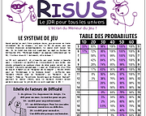

# Risus, le jeu de rôles

## Contenu du repo

Ce repo contient des ressources en français pour Risus :
* Les règles du jeu en anglais et en français ;
* Un flowchart synthétisant les règles du jeu ;
* Un écran à trois volets avec le jeu et d'autres tables
* Des règles pour jouer à Méga, le jeu de rôle des messagers galactiques.
Une traduction fidèle du jeu de Graham Walmsley. Un système de jeu hyper simple pour jouer sans préparation à des aventures dans le Mythe de Cthulhu.

## Publication

Les documents utilisables sont dans le folder "release" ou là : https://github.com/orey/jdr-risus/tree/main/_release

Ils sont aussi sur Itch : 

<table>
<tr><td></td>
<td><b>Risus le jeu de rôles</b> 
by <a href="https://rouboudou.itch.io">rouboudou</a> 
Cthulhu Dark, le jeu de rôles en français 
 
</td></tr>
</table>

