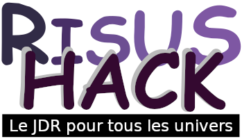

# Risus Hack

Bienvenue dans *Risus Hack* : Le jeu de rôle de tous les univers, un jeu de rôle sur table complet !

| Version         | 1.0          |
| Auteur original | S. John Ross |
| Hack            | O. Rey       |
| Date            | Juin 2024    |

## Pourquoi Risus Hack ?

Parce que les duels dans *Risus Hack* fonctionnent mal et qu'une petite modification au moteur de jeu permet de résoudre le problème. Si vous voulez en savoir plus, rendez-vous à la fin de cette page. Sinon, embarquement pour *Risus Hack* !

## Création de personnage

### Le Cliché

La notion de "Cliché" est au cœur de *Risus Hack*. Un Cliché résume un type de personne, englobant ses compétences, son histoire, son rôle social, un certain type de background et ainsi de suite.

Les classes de personnages des jeux de rôle les plus anciens peuvent être considérées comme des Clichés, par exemple Guerrier, Magicien, Pilote Stellaire ou Super-Espion.

Vous pouvez aussi choisir quelque chose de plus excentrique, comme Cuisinier Pirate Fantôme, Marraine Fée, Bruce Lee (ou un personnage "faisant des trucs à la Bruce Lee"), voire Monstre Géant Qui Veut Juste Être Aimé Pour Ses Macramés. Avec un Meneur de jeu très permissif, vous pouvez être tout ça à la fois.

Chaque Cliché est associé à un chiffre représentant un bonus que l'on nomme "Force" du Cliché. A chaque fois que votre capacité à être un Magicien, un Pilote Stellaire ou Bruce Lee, est mise en doute, vous lancez deux dés à 6 faces (noté 2D) et vous ajoutez la Force de votre Cliché comme bonus.

On considère généralement les niveaux suivants :

| Force du Cliché | Niveau        |
|-----------------|---------------|
| 1               | Débutant      |
| 2               | Dilettante    |
| 3               | Professionnel |
| 4               | Expert        |
| 5+              | Maître        |

*Table 1 : Niveau du personnage dans son Cliché en fonction de la Force du Cliché*

### Procédure de création du personnage

Le joueur possède 10 points de Force à dépenser en Clichés pour créer son personnage, avec un maximum de 4 points sur un seul Cliché.

Le joueur peut les dépenser comme il le souhaite, sur autant de Clichés qu'il le souhaite (10 étant le maximum).

Le premier Cliché de la liste est le Cliché principal, celui qui exprime le plus clairement la manière dont le personnage se perçoit.

A la fin de la création du personnage, ce dernier reçoit de 1 à 3 points de Destin (voir plus loin sur comment utiliser les points de destin).

### Exemple de personnage

Un personnage de Risus Hack complet ressemble à ceci :

**Nom** : Grolfnar Vainsson Le Viking,
 
**Description** : grand, blond et souriant. A un faible pour la bière, la bagarre, les belles femmes viking, la navigation en haute mer et le pillage. Son but dans la vie est d'écrire des sagas sur lui-même.

**Clichés** : Viking (4), Joueur (3), Dragueur (2),  Poète (1).

Pour créer Grolfnar, il nous a suffi de lui donner un nom, de le décrire et de choisir ses Clichés et de leur associer les points de Force de telle sorte que leur somme fasse 10.

### Options de création

#### Désavantage

Le MJ peut permettre au personnage d'avoir un désavantage. Ce dernier doit être gênant et pouvoir être utilisé par le MJ dans le jeu, par exemple une malédiction, une obsession, une faiblesse, un voeu, une blessure permanente et handicapante, etc.

Le désavantage rapporte 1 point de Force supplémentaire au joueur pour placer dans un des Clichés de son personnage.

#### Background

Un Background est une biographie écrite du personnage décrivant sa vie avant les événements du jeu. Le Background n'a pas besoin d'être long (une ou deux pages est déjà beaucoup). Il s'agit simplement d'indiquer au lecteur d'où le personnage vient, ce qu'il aime et ce qu'il n'aime pas, comment il est devenu ce qu'il est et quels sont ses motivations.

Un personnage ayant un Background écrit avant le jeu démarre avec 1 point de Force supplémentaire disponible pour la création du Personnage.

## Capacités et équipements

Chaque Cliché sous-entend :

* Que le personnage a certaines capacités,
* Que le personnage a un certain équipement.

### Adaptation du Cliché

Le Cliché du PJ recouvre un ensemble de traits qui, au yeux des joueurs comme du MJ, sont des traits incontestables du Cliché.

En revanche, à certains moments du jeu, le joueur pourra tenter d'utiliser le Cliché pour des traits du PJ qui ne sont pas, de manière claire, reliés au Cliché.

Au vu de l'argumentaire du joueur, le MJ décidera si le Cliché est adapté, partiellement adapté, peu adapté ou totalement inadapté. Il peut aussi, à sa convenance, demander aux autres joueurs ce qu'ils en pensent, voire même instaurer un vote.

En cas d'argumentaire particulièrement convaincant, drôle ou contribuant à l'histoire, suivant le roleplay du joueur, le joueur pourra utiliser complètement son Cliché et le MJ pourra gratifier le PJ d'un point d'expérience (noté XP, voir plus loin).

Le MJ peut aussi utiliser la table optionnelle ci-dessous.

| **Niveau de Cliché** | Adapté | Partiellement adapté    | Peu adapté  | Inadapté    |
|----------------------|--------|-------------------------|-------------|-------------|
| **Malus applicable** | Aucun  | -1 à la Force du Cliché | -2 (min. 1) | -3 (min. 0) |

*Table 2 : Malus à appliquer en cas de Cliché inadapté (option)*

Attention : si le malus porte la Force du Cliché à 0, le Cliché devient inadapté et ne peut pas être utilisé pour l'action.

### Equipement d'un personnage

Le Cliché sous-entend un certain équipement, disponible pour le personnage au moment de sa création.

Il est requis de noter sur la feuille de personnage le ou les objets les plus importants du Cliché. Cela ne comprend pas les vêtements et potentiellement les autres objets courants (à la volonté du MJ).

| Force du Cliché | Nombre d'objets maximum |
|-----------------|-------------------------|
| 1               | 1                       |
| 2               | 2                       |
| 3               | 3                       |
| n               | n                       |

*Table 3 : Nombre d'objets par Cliché*

Si ces objets étaient perdus, volés ou devenus inutilisables, et que l'objet est requis dans une scène, le jet de Cliché subira un malus compris entre -1 et la moitié de la Force du Cliché à la discrétion du MJ

#### Equipement de Grolfnar

| Cliché       | Equipement                                                            |
|--------------|-----------------------------------------------------------------------|
| Viking (4)   | Un casque de viking, une épée longue, un bouclier, une statue de Thor |
| Joueur (3)   | Un jeu de cartes, trois dés à six faces                               |
| Dragueur (2) | -                                                                     |
| Poète (1)    | Nécessaire à écrire (petit carnet, plume, encrier rudimentaire)       |

*Table 4: Equipement de Grolfnar (exemple)*

Si Grolfnar perd son épée, il deviendra Viking (2). S'il perd sa statue de Thor, il ne subira pas de malus en combat, mais sera Viking (2) s'il prie son dieu.

#### Equipement complémentaire

Au cours de leur vie aventureuse, des explorateurs chanceux peuvent découvrir du matériel enchanté, ou à la pointe de la technologie, ou tout simplement spécial.

Dans sa variante la plus simple, il s’agit d'équipement fournissant un ou plusieurs points de Force lorsque vous vous en servez.

Il peut aussi s'agir d’autres variétés de matériel spécial :

* Certaines modifient les mécanismes de jeu : "grâce à ce programme de pilotage expérimental, vous pouvez relancer tous les 1" ;
* D'autres donnent des pouvoirs durant le jeu : "seul le son d’un Stradivarius peut séduire un Prince Vampire" ;
* D'autres enfin octroient à la fois des avantages et des restrictions : "Lorsque vous combattez avec l’Épée de Miséricorde, vous aurez toujours un bonus équivalent à celui de votre adversaire, mais vous devez l’épargner si vous gagnez le combat".

## Le jet de Cliché

Le jet de Cliché est le seul type de jet que le joueur fera durant tout le jeu.

Pour faire un jet de Cliché, le joueur lance 2D, les additionne et ajoute la Force du Cliché.

#### Réussites et échecs critiques

Si les 2D lancés par le joueur sont un double 1 ou un double 6, le PJ subit respectivement un échec critique ou une réussite critique.

Les échecs et réussites critiques dépendent des actions entreprises :

* Actions sans opposition,
* Actions avec opposition, ou "combat".

## Action sans opposition

### Procédure

Lorsque quelqu’un essaye de faire quelque chose, que personne ne tente activement de l’en empêcher et que le meneur de jeu pense que le succès ne sera pas automatique, le joueur doit faire un "jet de Cliché".

La procédure pour tester si une action est la suivante :

* Le MJ détermine un Facteur de Difficulté (FD) compris entre 3 et 15 (7 étant le FD normal) ;
* Le joueur fait un jet de Cliché :
    * Si le jet est supérieur ou égal au FD, c'est réussi ;
    * Si le jet est inférieur strictement au FD, c'est raté.

### Facteur de Difficulté (FD)

La table ci-dessous montre les probabilités d'avoir une réussite selon le FD.

| FD/Cliché | (1) 2D+1 | (2) 2D+2 | (3) 2D+3 | (4) 2D+4 | (5) 2D+5 | (6) 2D+6 |
|-----------|----------|----------|----------|----------|----------|----------|
| 3         | 100      | 100      | 100      | 100      | 100      | 100      |
| 4         | 97       | 100      | 100      | 100      | 100      | 100      |
| 5         | 92       | 97       | 83       | 100      | 100      | 100      |
| 6         | 83       | 92       | 97       | 100      | 100      | 100      |
| 7         | 72       | 83       | 92       | 97       | 100      | 100      |
| 8         | 58       | 72       | 83       | 92       | 97       | 100      |
| 9         | 42       | 58       | 72       | 83       | 92       | 97       |
| 10        | 28       | 42       | 58       | 72       | 83       | 92       |
| 11        | 17       | 28       | 42       | 58       | 72       | 83       |
| 12        | 8        | 17       | 28       | 42       | 58       | 72       |
| 13        | 3        | 8        | 17       | 28       | 42       | 58       |
| 14        | -        | 3        | 8        | 17       | 28       | 42       |
| 15        | -        | -        | 3        | 8        | 17       | 28       |
| 16        | -        | -        | -        | 3        | 8        | 17       |
| 17        | -        | -        | -        | -        | 3        | 8        |
| 18        | -        | -        | -        | -        | -        | 3        |

*Table 5: Probabilités de réussite du jet de Cliché en fonction du FD*

Les difficultés à utiliser dépendent du MJ. Il est habituel d'utiliser les FD suivants :

* 7 : très facile ;
* 8 : facile (un peu plus d'une chance sur deux pour les Clichés de Force 1),
* 9 : moyenne,
* 10 : difficile, valable pour la plupart des jets (une chance sur quatre pour les Clichés de Force 1),
* 11+ : très difficile.

#### Réussite et échec critique

En cas d'échec critique, le MJ déterminera la conséquence désagréable devant être subie par le PJ. Même si le jet de Cliché est supérieur ou égal au FD, un double 1 restera toujours un échec critique.

De la même façon, en cas de réussite critique, même si le jet de Cliché est raté par rapport au FD, il est réussi en cas de double 6. Là aussi, c'est au MJ de déterminer les conséquences de cette réussite hors du commun.

#### Exemple

Grolfnar participe à un festin Viking et, comme les autres Vikings présents, il boit beaucoup.

Echauffé par l'alcool, il désire aller provoquer son ennemi Wulf assis non loin, mais le MJ dit que cette action nécessite un jet de Viking (4) au FD=12 car ce dernier n'est pas certain de tenir debout. Le joueur jouant Grolfnar lance 2D et obtient 6 et 2, pour un jet de Cliché à 6+2+4=12. C'est réussi de justesse. Grolfnar parvient à se lever et à se diriger vers Wulf sans encombre.

## Combat

### Divers types de combat

Dans Risus Hack, le "combat" est défini comme toute action avec opposition, par exemple quand des adversaires tentent d’améliorer leur position, d’attaquer, de se défendre ou d’avoir à l'usure leurs adversaires, littéralement ou métaphoriquement, pour arriver à une victoire.

Voici quelques exemples de "combats" possibles :

* **Débat** : des combattants maniant la logique, les arguments et les astuces rhétoriques pour faire triompher leur opinion ;
* **Course de chevaux** : des jockey sur des chevaux galopant comme des fous sur une piste boueuse pour savoir qui franchira l'arrivée le premier ;
* **Combat aérien** : des pilotes d’avions ou de vaisseaux spatiaux se combattant  mutuellement dans le ciel ;
* **Duels astraux / psychiques** : des mystiques/psionics paraissant fatigués ou pleins d'ennui, en train de se déchirer l'ego dans l'outreront ;
* **Duels de magiciens** : des sorciers usant d'une étrange magie tentant de se surpasser l'un l'autre ;
* **Duels de banjos** : des joueurs de banjos tentant de se dominer à l'aide de mélodies bizarres ;
* **Séduction** : un personnage tentant de séduire un autre personnage qui résiste ;
* **Un combat au tribunal** : le procureur contre la défense, lors d'un procès ;
* **Un vrai combat** : des gens tentant de se blesser ou se tuer.

### Détermination du Cliché

Le MJ décide que le combat commence. A partir de ce moment, il prend les joueurs un par un autour de la table et leur demande de faire une attaque. Ce qui constitue une attaque dépend de la nature du combat. Si des dialogues sont requis dans cette phase, le moment devrait toujours être un moment de roleplay. Si l'attaque est physique et/ou dangereuse, la scène devrait être décrite d'une manière détaillée et amusante.

Le MJ détermine quel type de Cliché est adapté pour le combat.

Par exemple, dans un combat à mains nues, des Clichés comme Viking, Soldat, Bretteur, ou Ernest Hemingway sont adaptés, tandis que des Clichés comme Coiffeur ou Latin Lover ne le sont pas.

Pour les Clichés inadaptés, le MJ peut attribuer un malus au personnage et utiliser la table 2.

### Round de combat

Un combat est divisé en rounds de durée variable. Le MJ décrit la scène.

Les attaques doivent viser un adversaire : les deux parties impliquées font chacune leur jet de Cliché :

* Le plus haut score gagne le round ;
* Le perdant perd un point de Force sur son Cliché ; on dit que le PJ subit un dommage de 1 point.

Le round suivant peut commencer.

Quand la Force du Cliché d'un combattant tombe à 0, le combattant a perdu le combat.

### Combat avec un Cliché inadapté

Si le joueur convainc le MJ d'utiliser un Cliché inadapté, que le joueur soit ou non soumis au malus proposé en option dans la table 2, en cas de victoire, le joueur inflige double dommages (-2 au Cliché de l'adversaire)

### Sort du perdant

Le perdant est à la merci du bon vouloir du vainqueur qui doit décider de son sort :
* Dans le cadre d'un combat physique ou magique, il est possible que le vaincu soit tué, ou épargné par la clémence du vainqueur ;
* Dans le cadre d'un procès, le vaincu a perdu et est soit condamné, soit l'accusé est innocenté ;
* Dans le cadre d'une séduction, le vainqueur est soit couronné de succès, soit il éconduit la personne qui tente de le séduire.

### Réussite et échec critique

En combat, les conséquences de l'échec critique sont déterminées par le MJ. Tout d'abord, un échec critique fait perdre le round, d'où une perte de 1 point de Force du Cliché.

De plus, le fait que l'échec soit critique implique que le PJ perd entre 1 point supplémentaire de Force de Cliché et la moitié de ses points de Cliché. Les raisons peuvent être multiples :

* Perte de son arme,
* Endommagement de l'arme la rendant inutilisable,
* Choc avec un objet ou un mur,
* Etc.

Pour une réussite critique, les choses sont symétriques : le PJ vainqueur gagne le round et gagne quelque chose en plus.

Ce dernier négocie alors avec le MJ pour influer sur le cours de l'histoire. Il peut, par exemple :

* Assommer le perdant,
* Lui infliger 1D de dommages à son Cliché,
* Briser son arme,
* Faire une prouesse comme couper la ceinture de son pantalon pour que ce dernier tombe sur les chevilles de son adversaire,
* Etc.

### Probabilités de réussite

La table 7 montre es probabilités de succès à Risus Hack durant un combat. Pour chaque cellule, trois chiffres sont proposés :

* Le pourcentage de chances que l'attaquant gagne le round.
* Le pourcentage de chances que les deux combattants soient ex-aequo,
* Le pourcentage de chances que le défenseur gagne le round.

| Att. / Déf. | (1) 2D+1 | (2) 2D+2 | (3) 2D+3 | (4) 2D+4 | (5) 2D+5 | (6) 2D+6 |
|-------------|----------|----------|----------|----------|----------|----------|
| (1) 2D+1    | 44/11/44 | 34/11/56 | 24/10/66 | 16/8/76  | 10/6/84  | 5/4/90   |
| (2) 2D+2    | 56/11/34 | 44/11/44 | 34/11/56 | 24/10/66 | 16/8/76  | 10/6/84  |
| (3) 2D+3    | 66/10/24 | 56/11/34 | 44/11/44 | 34/11/56 | 24/10/66 | 16/8/76  |
| (4) 2D+4    | 76/8/16  | 66/10/24 | 56/11/34 | 44/11/44 | 34/11/56 | 24/10/66 |
| (5) 2D+5    | 84/6/10  | 76/8/16  | 66/10/24 | 56/11/34 | 44/11/44 | 34/11/56 |
| (6) 2D+6    | 90/4/5   | 84/6/10  | 76/8/16  | 66/10/24 | 56/11/34 | 44/11/44 |

*Table 7 : probabilités de succès des duels dans Risus Hack*

### Exemple

Grolfnar, Viking (4), et Wulf, Viking (5), se battent au corps à corps.

| Round | Grolfnar / Succès | Wulf /Succès         | Résultat Grolfnar | Résultat Wulf  | Commentaire                |
|-------|-------------------|----------------------|-------------------|----------------|----------------------------|
| 1     | 6 + 2 + C(4) = 12 | 5 + 5 + C(5) = 15    | Viking (4-1=3)    | Viking (5)     | Grolfnar a perdu le round  |
| 2     | 4 + 1 + C(3) = 8  | 2 + 1 + C(5) = 8     | Viking (3)        | Viking (5)     | Ex-aequo                   |
| 3     | 5 + 3 + C(3) = 11 | 4 + 1 + C(5) = 10    | Viking (3)        | Viking (5-1=4) | Grolfnar a gagné le round  |
| 4     | 4 + 3 + C(3) = 10 | 3 + 1 + C(4) = 8     | Viking (3)        | Viking (4-1=3) | Grolfnar a gagné le round  |
| 5     | 6 + 1 + C(3) = 10 | 4 + 2 + C(3) = 9     | Viking (3)        | Viking (3-1=2) | Grolfnar a gagné le round  |
| 6     | 4 + 1 + C(3) = 8  | 4 + 3 + C(2) = 9     | Viking (3-1=2)    | Viking (2)     | Grolfnar a perdu le round  |
| 7     | 3 + 1 + C(2) = 6  | 1 + 1 échec critique | Viking (2)        | Viking (2-2=0) | Grolfnar a gagné le combat |

Suite à l'échec critique de Wulf, le MJ décide que ce dernier a dérapé et s'est cogné la tête au sol, le rendant ainsi inconscient. Grolfnar doit maintenant décider du sort de Wulf.

### Regagner les points de Force perdus

Les dés perdus pendant le combat sont regagnés à partir de la fin du combat à une vitesse déterminée par le MJ en fonction du type de "dommages".

Si le combat s'est déroulé à bord de véhicules (vaisseaux spatiaux, robots géants, galions, etc.), les véhicules sont aussi endommagés et ils doivent être réparés.

Parfois, regagner les points de Force perdus n'est pas seulement une question de temps mais aussi de *conditions* spécifiées par le MJ ("maintenant que tu as été battu à plate couture, tu ne peux même plus *regarder* ton banjo avant que ta petite amie ne vienne soulager ton ego").

### Durée du round

Il n'y pas d'échelle standard de temps et d'espace dans Risus, tout dépend du contexte.

Dans un combat physique, le round durera quelques secondes tandis qu'il pourra durer une journée entière dans le cadre d'un combat de long terme entre mari et femme.

### Cliché inadapté

Le MJ détermine les Clichés adaptés pour le type de Combat, ce qui signifie que certains Clichés ne sont pas adaptés. Par exemple, dans un combat physique, Coiffeur est inadapté. Dans un combat magique, Barbare est inadapté.

Les Clichés inadaptés ne sont pas interdits dans les Combats. Ils peuvent toujours être utilisés selon les modalités décrites dans la section *Adaptation du Cliché*.

### Conflit à action unique

Le Combat est une mécanique à plusieurs rounds basé sur l'usure des combattants. Pour autant, certains conflits sont trop rapides pour être joués de la sorte (deux personnages tentant d'attraper le même pistolet par exemple).

Ces Conflits à Action Unique sont résolus via un seul jet avec le Cliché adapté (ou inadapté avec le bon roleplay ou avec les malus proposés Table 2). Le plus haut score gagne. En cas d'égalité, le MJ fait refaire un jet de Cliché aux joueurs. Si l'égalité perdure, faites lancer 1D à chaque joueur et celui qui a le plus haut chiffre gagne.

### Exemple

Grolfnar, Viking (4), et Wulf, Viking (5), veulent tous deux attraper le dernier poulet roti sur la table du festin. Ils jettent respectivement leurs dés : 

* Grolfnar obtient 5 et 4 comptabilisant 5 + 4 + C(4) = 13,
* Wulf obtient 4 et 1 comptabilisant 4 + 1 + C(5) = 10.

 Grolfnar attrape le dernier poulet roti avant Wulf.

### Utilisation des points de Destin

A tout moment, un joueur peut utiliser un point de Destin pour un jet de Cliché. Pour une action ou un round, la Force de son Cliché est doublée pour cette action ou ce round.

### Pouvoirs
#### Gestion de la magie ou des pouvoirs

La magie et les pouvoirs peuvent avoir des effets dévastateurs. Aussi, les Clichés ayant des pouvoirs coûtent deux fois plus cher en points de Force que les clichés normaux.

Ainsi un Magicien [4]

**Reprendre ici**

Les adversaires des PJs ayant des pouvoirs ont un indice de résistance aux pouvoirs, généralement 1, mais ce dernier peut aller de 1/2 à un grand nombre.

Un possesseur de pouvoirs ne peut pas, en combat, infliger plus de dommage que ce qu'

propose que ces Clichés se consument d'eux-mêmes à chaque utilisation.

Ainsi, pour un Magicien des Bois Noirs (4), quatre points de sort sont disponibles avant évanouissement. La plupart des sorts coûtent 1 point de Force, mais il en existe qui ne coûtent que 0.5 PF et d'autres dont le coût est plus que 2 PF.

Quelque soit le pouvoir invoqué par le joueur, le pouvoir ne peut infliger plus de PF aux PNJ qu'il n'en a, lui-même 

## Travailler en équipe

Deux personnages ou plus peuvent former une équipe durant un Combat. Pour la durée de l'équipe (généralement le Combat complet), ils se battent comment un seul groupe et ne peuvent être attaqués que comme un seul adversaire.

Il existe deux types d'équipes :

* Les équipes de personnages (pour les PJ et les PNJ les plus intéressants),
* Les hordes grognantes (pour les groupes de PNJ anonymes).

### Hordes grognantes

Les Hordes Grognantes sont gérées de manière spéciale.

Quand une horde de 700 rats-squelettes attaquent les PC dans la tanière d'un Nécromant Mauvais (5), le MJ les déclare en tant que Horde Grognante afin de les traiter comme un seul ennemi : Horde de Rats-Squelettes (7). En termes de mécanique, la horde est similaire à un seul ennemi sauf que son bonus est plus élevé.

Les Hordes Grognantes reste groupées en équipe jusqu'à ce qu'elles soient vaincues. A ce moment, quelques survivants peuvent se disperser, sachant qu'au moins un élément de la Horde devrait rester en attente de la décision du vainqueur.

Si l'on pousse la logique à l'extrême, un équipage entier de navire, ou même une forêt entière, des souterrains, des villes ou des nations pourraient être représentées comme un seul Cliché.

### Equipes de personnages

Quand les PJ (et/ou les PNJ notables) forment une équipe, le chef d'équipe est le personnage qui possède le plus haut Cliché applicable (en cas d'égalité, l'équipe doit désigner un chef).

Toute l'équipe va faire des jets mais seul le jet du chef d'équipe compte complètement. Les autres membres de l'équipe ne contribuent que s'ils font 6 sur leur Cliché : cette contribution ajoute +1 au Cliché du chef d'équipe.

Les Clichés utilisés au sein de l'équipe n'ont pas besoin d'être identiques et, si tant est que le MJ est convaincu, ils peuvent être un mélange de Clichés adaptés et inadaptés (un groupe de Guerriers peut être aidé par leur Ménestrel, par exemple). Pour autant, ils ne double pas les Dommages endurés par l'ennemi, sauf s'ils utilisent tous des Clichés inadaptés (ce qui signifie que les joueurs doivent expliquer au MJ exactement comment un Coiffeur, un Dresseur de Perruches et un Coach se coordonnent pour battre Dark Vador).

Quand l'équipe perd un round de combat, le Cliché d'un seul membre de l'équipe est réduit de 1.

Chaque membre de l'équipe, incluant le chef, peut décider d'encaisser ces dommages volontairement. Si c'est le cas, ce dernier subit le double de la perte normale (-2), mais le chef d'équipe bénéficiera d'un bonus de vengeance : il pourra, en effet, avoir un bonus multiplié par 2 lors de la prochaine attaque, comme vengeance de l'équipe suite aux dommages encaissés par l'un des leurs.

Si aucun membre de l'équipe n'est volontaire, le chef d'équipe désigne le membre qui prendra les dommages. Ces derniers ne seront pas doublés et ne donneront pas lieu à un bonus de vengeance.

#### Victoire et défaite

Avec les équipes comme avec les individus, le vainqueur détermine le sort du vaincu, mais quand le vaincu fait partie d'une équipe, la détermination du sort du vaincu est généralement repoussée à la fin de l'existence de l'équipe (même s'il est vaincu pendant le combat fait encore rage). Cela signifie que l'équipe gagnante décide dans tous les cas.

Dans certains cas néanmoins, les PJs sont dans de telles circonstances précaires, que leur sort doit être déterminé immédiatement. Mais dans la plupart des cas, faire partie d'une équipe, spécialement une équipe gagnante, est une excellente assurance.

#### Dissoudre l'équipe

Une équipe peut volontairement se dissoudre à tout moment. Lors de cette dissolution, tous les membres de l'équipe perdent immédiatement 1 point de Force dans le Cliché qui leur servait à contribuer à l'équipe.

Les membres libres pourront former de nouvelles équipes pourvu que la perte de 1 point de Force ne les ait pas transformés en vaincus.

Un individu peut aussi se retirer d'une équipe, mais son score de Cliché passera alors immédiatement à 0 alors qu'il courre à l'arrière. Leur sort dépendra de la miséricorde de celui qui gagnera le Combat.

#### Perte du chef d'équipe

Si le chef d'équipe quitte l'équipe, quelque soit la raison (il se retire ou son Cliché tombe à 0), l'équipe doit se dissoudre immédiatement (voir ci-dessus).

Les membres de l'équipe dissoute peuvent décider de reformer une équipe immédiatement avec un nouveau chef, ce dernier ayant droit à un bonus de vengeance pour venger son prédécesseur.

## Expérience

### Points de Destin

Quand les joueurs ont été héroïques ou qu'ils ont été particulièrement brillants de par leur roleplay ou leur inventivité, le MJ peut les gratifier d'un point de Destin.

A la fin de l'aventure, les PJs devraient regagner entre 1 et 3 points de Destin selon leur performance dans le scénario.

### Progression des personnages

Après chaque séance, les joueurs ont une chance de faire progresser un Cliché de 1 point de Force.

#### Clichés existants

A la fin de chaque aventure, chaque joueur lance les dés de tous les Clichés qui ont été sollicités durant le jeu. S'il n'obtient que des chiffres pairs, alors le Cliché est candidat pour être augmenté.

Le joueur doit alors choisir dans les candidats quel Cliché doit être augmenté de 1.

Il n'y a pas de limite de progression.

#### Nouveaux Clichés

Si le joueur s'est particulièrement illustré dans des actions qui ne sont pas couvertes par ses Clichés, il peut, avec l'accord du MJ, créer un nouveau Cliché (1) suite à son gain d'expérience.
    
## Annexe : le système de jeu de Risus Hack

### 2 mécanismes simples au coeur de tous les JDR

Les deux mécanismes simples au coeur de tous les JDR (si l'on exclue la magie et les autres pouvoirs) sont :

* Le test de compétences,
* Le combat ou duel.

Pour ce qui est combat ou duel, les différents jeux utilisent l'un des mécanismes suivants :

1. Chaque joueur fait son jet contre un FD dépendant de l'adversaire et des conditions ; le jeu ne propose que des attaques unilatérales (*D&D* par exemple avec la Classe d'Armure (CA) ou *armor class* (AC)) ;
1. Les deux joueurs font un jet l'un contre l'autre en même temps, le meilleur score gagne ;
1. Un joueur fait son jet d'attaque avec divers modificateurs, puis le défenseur fait son jet de défense avec divers modificateurs (*Basic RPG*, *GURPS*).

Risus entre dans la deuxième catégorie.

### Ye Good Olde System (YGOS)

[YGOS](https://www.risusiverse.com/home/optional-rules/ye-good-olde-system) propose de corriger le système de jeu de Risus en lançant 1D6 et d'ajouter la valeur du Cliché comme *bonus*.

Ainsi, quand Grolfnar fait un truc de Viking (4), il lance 1D+4. Quand il poétise (Poète (1)), il lance 1D+1.

#### Test de compétences avec YGOS

La table des FD devient alors la table A3.

| FD  | Commentaire                                                 |
|-----|-------------------------------------------------------------|
| 1   | Automatique. Pas la peine de lancer les dés                 |
| 2   | Vous avez marché sur cette fourmi ? Bravo                   |
| 3   | Seul un vrai bleu peut rater                                |
| 4   | Défi pour un nase, routine pour un pro                      |
| 5   | Sans doute un peu difficile                                 |
| 6   | Un défi pour un professionnel                               |
| 7   | Ouah, ce saut était... impressionnant                       |
| 8   | Un défi héroïque. Vraiment inventif ou cascades complexes   |
| 9   | Je n'arrive pas à croire que vous y êtes arrivé. Stupéfiant |
| 10  | Un défi pour un maître. Difficulté presque surhumaine       |
| 11+ | Vous voulez rire. Difficulté vraiment surhumaine            |

*Table A1: les FD selon YGOS*

Qu'en est-il des vraies probabilités ? La table A4 les montre.

| FD/Cliché | (1) D+1 | (2) D+2 | (3) D+3 | (4) D+4 | (5) D+5 | (6) D+6 |
|-----------|---------|---------|---------|---------|---------|---------|
| 2         | 100     | 100     | 100     | 100     | 100     | 100     |
| 3         | 83      | 100     | 100     | 100     | 100     | 100     |
| 4         | 67      | 83      | 100     | 100     | 100     | 100     |
| **5**     | **50**  | **67**  | **83**  | **100** | **100** | **100** |
| 6         | 33      | 50      | 67      | 83      | 100     | 100     |
| 7         | 17      | 33      | 50      | 67      | 83      | 100     |
| 8         | -       | 17      | 33      | 50      | 67      | 83      |
| 9         | -       | -       | 17      | 33      | 50      | 67      |
| 10        | -       | -       | -       | 17      | 33      | 50      |
| 11        | -       | -       | -       | -       | 17      | 33      |
| 12        | -       | -       | -       | -       | -       | 17      |

*Table A2 : probabilités de réussite de compétences dans YGOS*

Nous voyons un peu le même défaut que dans les autres systèmes. La difficulté 8 est inaccessible aux Clichés (1).

#### Duel avec YGOS

La table A5 donne les probabilités pour le duel (même convention : victoire / ex-aequo / défaite).

| Att. / Déf. | (1) D+1  | (2) D+2  | (3) D+3  | (4) D+4  | (5) D+5  | (6) D+6  |
|-------------|----------|----------|----------|----------|----------|----------|
| (1) D+1     | 42/17/42 | 28/14/58 | 17/11/72 | 8/8/83   | 3/6/92   | 0/3/97   |
| (2) D+2     | 58/14/28 | 42/17/42 | 28/14/58 | 17/11/72 | 8/8/83   | 3/6/92   |
| (3) D+3     | 72/11/17 | 58/14/28 | 42/17/42 | 28/14/58 | 17/11/72 | 8/8/83   |
| (4) D+4     | 83/8/8   | 72/11/17 | 58/14/28 | 42/17/42 | 28/14/58 | 17/11/72 |
| (5) D+5     | 92/6/3   | 83/8/8   | 72/11/17 | 58/14/28 | 42/17/42 | 28/14/58 |
| (6) D+6     | 97/0/3   | 92/6/3   | 83/8/8   | 72/11/17 | 58/14/28 | 42/17/42 |

*Table A3 : combat dans YGOS*

Le problème est atténué par rapport au Risus original, mais les différences de 1 sont encore très marquées. En effet, un bonus de +1 apporte un pas de 17%, ce qui correspondrait quasiment à un +4 dans une échelle d20 (différence entre un débutant et un expert).

### Risus Hack

Le problème du YGOS est que le bonus du Cliché est, en valeur, très important en comparaison de l'intervalle de lancers possibles d'1D.

Pour corriger le YGOS, il est possible de s'inspirer de *Fighting Fantasy* et de lancer 2D au lieu de lancer 1D.

Chaque joueur, que ce soit pour un test de compétences ou un Duel lancera 2D+Cliché. C'est le mécanisme de base de Risus Hack.

#### Jet de compétences

La table A4 présente les probabilités de succès d'un test de compétences contre un Facteur de Difficulté.

| FD/Cliché | (1) 2D+1 | (2) 2D+2 | (3) 2D+3 | (4) 2D+4 | (5) 2D+5 | (6) 2D+6 |
|-----------|----------|----------|----------|----------|----------|----------|
| 3         | 100      | 100      | 100      | 100      | 100      | 100      |
| 4         | 97       | 100      | 100      | 100      | 100      | 100      |
| 5         | 92       | 97       | 83       | 100      | 100      | 100      |
| 6         | 83       | 92       | 97       | 100      | 100      | 100      |
| **7**     | **72**   | **83**   | **92**   | **97**   | **100**  | **100**  |
| 8         | 58       | 72       | 83       | 92       | 97       | 100      |
| 9         | 42       | 58       | 72       | 83       | 92       | 97       |
| **10**    | **28**   | **42**   | **58**   | **72**   | **83**   | **92**   |
| 11        | 17       | 28       | 42       | 58       | 72       | 83       |
| 12        | 8        | 17       | 28       | 42       | 58       | 72       |
| 13        | 3        | 8        | 17       | 28       | 42       | 58       |
| 14        | -        | 3        | 8        | 17       | 28       | 42       |
| 15        | -        | -        | 3        | 8        | 17       | 28       |
| 16        | -        | -        | -        | 3        | 8        | 17       |
| 17        | -        | -        | -        | -        | 3        | 8        |
| 18        | -        | -        | -        | -        | -        | 3        |

*Table A4 : probabilités de réussite de compétences de Risus Hack*

#### Duel

La table A5 propose une vue du système 2D+Cliché pour les combats.

| Att. / Déf. | (1) 2D+1 | (2) 2D+2 | (3) 2D+3 | (4) 2D+4 | (5) 2D+5 | (6) 2D+6 |
|-------------|----------|----------|----------|----------|----------|----------|
| (1) 2D+1    | 44/11/44 | 34/11/56 | 24/10/66 | 16/8/76  | 10/6/84  | 5/4/90   |
| (2) 2D+2    | 56/11/34 | 44/11/44 | 34/11/56 | 24/10/66 | 16/8/76  | 10/6/84  |
| (3) 2D+3    | 66/10/24 | 56/11/34 | 44/11/44 | 34/11/56 | 24/10/66 | 16/8/76  |
| (4) 2D+4    | 76/8/16  | 66/10/24 | 56/11/34 | 44/11/44 | 34/11/56 | 24/10/66 |
| (5) 2D+5    | 84/6/10  | 76/8/16  | 66/10/24 | 56/11/34 | 44/11/44 | 34/11/56 |
| (6) 2D+6    | 90/4/5   | 84/6/10  | 76/8/16  | 66/10/24 | 56/11/34 | 44/11/44 |

*Table A5 : probabilités de succès des duels dans Risus Hack*

Les chances de succès sont beaucoup plus équilibrées entre les protagonistes.

#### Risus Hack

C'est ce système qui a été choisi pour *Risus Hack*. Contrairement à *Fighting Fantasy*, il ne teste pas les compétences sous forme de jet sous la compétence, mais nous gardons la mécanique des facteurs de difficulté qui a pour intérêt de pouvoir grandit avec les personnages. En effet, rien , dans le système *Risus Hack* n'interdira que Grolfnar, Viking (8), s'affronte à jour à Wulf, Viking (11).

