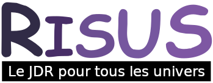

# Risus Pool

Bienvenue dans Risus Pool : Le jeu de rôle de tous les univers, un jeu de rôle sur table complet !

## Création de personnage

### Le Cliché

La notion de "Cliché" est au cœur de Risus Pool. Un Cliché résume un type de personne, englobant ses compétences, son histoire, son rôle social et ainsi de suite.

Les classes de personnages des jeux de rôle les plus anciens peuvent être considérées comme des Clichés, par exemple Guerrier, Magicien, Pilote Stellaire ou Super-Espion.

Mais vous pouvez aussi choisir quelque chose de plus excentrique, comme Cuisinier Pirate Fantôme, Marraine Fée, Bruce Lee (ou un personnage faisant des trucs à la Bruce Lee), voire Monstre Géant Qui Veut Juste Être Aimé Pour Ses Macramés. Avec un Meneur de jeu très permissif, vous pouvez être tout ça à la fois.

Chaque Cliché est associé à un chiffre représentant un nombre de dés à six faces. A chaque fois que votre capacité à être un Magicien, un Pilote Stellaire ou Bruce Lee, est mise en doute, vous lancez un nombre de dés égal à ce chiffre.

On considère généralement les niveaux suivants :

| Nombre de dés | Niveau        |
|---------------|---------------|
| 1D            | Débutant      |
| 2D            | Dilettante    |
| 3D            | Professionnel |
| 4D            | Expert        |
| 5D+           | Maître        |

### Procédure de création du personnage

Vous avez 10 dés à dépenser en Clichés avec un maximum de 4 dés sur un seul Cliché.

Vous pouvez les dépenser comme vous le souhaitez, sur autant de Clichés que vous le souhaitez, dix étant le maximum.

Le premier Cliché de la liste est votre Cliché principal, celui qui exprime le plus clairement la manière dont votre personnage se perçoit ("Viking" dans le cas de Grolfnar).

Vous avez aussi 10 points d'énergie. Si ce score tombe à 0 à un moment, vous vous évanouissez. Si le score devient négatif, le personnage meurt.

### Exemple de personnage

Un personnage de Risus Pool complet ressemble à ceci :

**Nom** : Grolfnar Vainsson Le Viking,
 
**Description** : grand, blond et souriant. A un faible pour la bière, la bagarre, les belles femmes viking, la navigation en haute mer et le pillage. Il veut écrire des sagas sur lui-même.

**Clichés** : Viking (4), Joueur (3), Dragueur (2),  Poète (1).

Pour créer Grolfnar, il nous a suffi de lui donner un nom, de le décrire et de choisir ses Clichés.

## Capacités et équipements

Chaque Cliché sous-entend :

* Que le personnage a certaines capacités,
* Que le personnage a un certain équipement.

### Adaptation du Cliché

Le Cliché du PJ recouvre un ensemble de traits qui, au yeux des joueurs comme du MJ, sont des traits incontestables du Cliché.

En revanche, à certains moments du jeu, le joueur pourra tenter d'utiliser le Cliché pour des traits du PJ qui ne sont pas, de manière claire, rattachables au Cliché.

Au vu de l'argumentaire du joueur, le MJ décidera si le Cliché est complètement adapté, partiellement adapté, peu adapté ou totalement inadapté. Il peut aussi, à sa convenance, demander aux autres joueurs ce qu'ils en pensent, voire même instaurer un vote. En cas d'argumentaire particulièrement convaincant, drôle ou contribuant à l'histoire, suivant le roleplay du joueur, le MJ pourra gratifier le PJ d'un point d'expérience (noté XP, voir plus loin).

Le tableau ci-dessous peut aussi aider.

| Adapté           | Partiellement adapté | Peu adapté    | Inadapté |
|------------------|----------------------|---------------|----------|
| Valeur du cliché | -1D ou 3D max        | -2D ou 2D max | 1D max   |

### Equipement d'un personnage

Le Cliché sous-entend un certain équipement, disponible pour le personnage au moment de sa création.

Il est requis de noter sur la feuille de personnage le ou les objets les plus importants du Cliché. Cela ne comprend pas les vêtements et potentiellement les autres objets courants (à la volonté du MJ).

| Cliché | Nombre d'objets maximum | 
|--------|-------------------------|
| 1D     | 1                       |
| 2D     | 2                       |
| 3D     | 3                       |
| nD     | n                       |

Si ces objets étaient perdus, volés ou devenus inutilisables, et que l'objet est requis dans la scène, le jet de Cliché subira un malus compris entre -1D et la moitié de la valeur du Cliché.

#### Equipement de Grolfnar

| Cliché       | Equipement                                                            |
|--------------|-----------------------------------------------------------------------|
| Viking (4)   | Un casque de viking, une épée longue, un bouclier, une statue de Thor |
| Joueur (3)   | Un jeu de cartes, trois dés à six faces                               |
| Dragueur (2) | -                                                                     |
| Poète (1)    | Nécessaire à écrire (petit carnet, plume, encrier)                    |

Si Grolfnar perd son épée, il deviendra Viking (2). S'il perd sa statue de Thor, il ne subira pas de malus en combat, mais sera Viking (2) s'il prie son dieu.

#### Equipement complémentaire

Au cours de leur vie aventureuse, des explorateurs chanceux peuvent découvrir du matériel enchanté, ou à la pointe de la technologie, ou tout simplement spécial.

Dans sa variante la plus simple, il s’agit d'équipement fournissant un ou plusieurs dé de bonus lorsque vous vous en servez.

Il peut aussi s'agir d’autres variétés de matériel spécial :

* Certaines modifient les mécanismes de jeu : "grâce à ce programme de pilotage expérimental, vous pouvez relancer tous les 1" ;
* D'autres donnent des pouvoirs durant le jeu : "seul le son d’un Stradivarius peut séduire un Prince Vampire" ;
* D'autres enfin octroient à la fois des avantages et des restrictions : "Lorsque vous combattez avec l’Épée de Miséricorde, vous jetez toujours au moins autant de dés que votre adversaire, mais vous devez l’épargner si vous gagnez le combat".

## Système de jeu

### Jet de Cliché

#### Principe

Lorsque quelqu’un essaye de faire quelque chose, que personne ne tente activement de l’en empêcher et que le meneur de jeu pense que le succès ne sera pas automatique, le joueur doit faire un "jet de Cliché".

La procédure est la suivante :

* Le MJ détermine un facteur de difficulté FD compris entre 3 et 6 ;
* Le joueur lance des dés et compte le nombre de dés supérieurs ou égaux au FD.

La table ci-dessous montre les probabilités d'avoir une réussite selon le FD.

| FD    | 1D6     | 2D6     | 3D6     | 4D6     | 5D6     | 6D6     |
|-------|---------|---------|---------|---------|---------|---------|
| 2     | 83%     | 97%     | 99%     | 100%    | 100%    | 100%    |
| 3     | 67%     | 89%     | 96%     | 99%     | 99%     | 100%    |
| 4     | 50%     | 75%     | 88%     | 94%     | 97%     | 98%     |
| **5** | **33%** | **56%** | **70%** | **80%** | **87%** | **91%** |
| 6     | 17%     | 31%     | 42%     | 52%     | 60%     | 67%     |

Les difficultés suivantes doivent être utilisées dans le jeu :

* 3 : très facile ;
* 4 : facile (une chance sur deux pour les Clichés à 1D6),
* **5 : moyenne**, valable pour la plupart des jets (une chance sur trois pour les Clichés de 1D6),
* 6 : difficile.

#### Marge de réussite

Suivant les actions entreprises, le MJ peut agir en fonction de la marge de réussite (MR) qui est le nombre de dés qui dépassent le FD.

| MR | Niveau de réussite | Option sur la marge de réussite             |
|----|--------------------|---------------------------------------------|
| 1  | Normal             | Réussi mais ajout d'une petite contrariété  |
| 2  | Bon                | -                                           |
| 3+ | Très bon           | Réussi et ajout de quelque chose de positif |

Il est possible d'utiliser l'option sur la MR et donc de rajouter un "mais" en cas de réussite normale et un "et" en cas de très bonne réussite.

#### Exemple

Grolfnar est dans une réunion Viking et il boit beaucoup. Il souhaite aller provoquer son ennemi Wulf assis non loin, mais le MJ dit que cette action nécessite un jet de Viking (4) car ce dernier n'est pas certain de tenir debout. Le joueur jouant Grolfnar joue et obtient 6, 5, 2 et 1, soit un jet réussi avec une MR de 2. Il parvient à se lever et à se diriger vers Wulf.

#### Option : Baisser le FD moyen

Certains jeux héroïques nécessitent que les PJ réussissent souvent les actions qu'ils entreprennent. Dans ce cas, il est possible de prendre 4 comme difficulté moyenne

### Options

Les options suivantes sont disponibles au MJ s'il souhaite les utiliser.

#### La règle du 6

Il est possible pour le MJ de considérer les variantes suivantes concernant un dé dont la valeur serait 6 :

* Le 6 est dé **explosif**, il compte pour une réussite et doit être relancé, ce qui peut donner lieu à une autre réussite. Dans le cas d'un nouveau 6, on compte une nouvelle réussite et on relance, et ainsi de suite, jusqu'à ce que la valeur du dé tiré ne soit plus un 6.
* Le 6 **compte double** : au lieu de compter pour une réussite, il compte pour deux.

#### Coups critiques

Même si un jet de 1 est toujours un échec et un jet de 6 est toujours une réussite, il est possible de déterminer des réussites et échecs critiques en utilisant la table suivante.

| Cliché | Réussite critique | Echec critique |
|--------|-------------------|----------------|
| 1D/2D  | -                 | -              |
| 3D     | Deux 6            | Deux 1         |
| 4D     | Trois 6           | Trois 1        |
| 5D     | Quatre 6          | Quatre 1       |
| nD     | n-1 6             | n-1 1          |

Un échec critique classique est la rupture de l'arme du PJ ou le fait de se blesser lui-même durant une action

## Combat

### Divers types de combat

Dans Risus Pool, le "combat" est défini comme toute occasion où des adversaires tentent d’améliorer leur position, d’attaquer, de se défendre ou d’avoir à l'usure leurs adversaires, littéralement ou métaphoriquement, pour arriver à une victoire. Parmi les exemples de "combats" possibles :

* **Débat** : des combattants maniant la logique, les arguments et les astuces rhétoriques pour faire triompher leur opinion ;
* **Course de chevaux** : des jockey sur des chevaux galopant comme des fous sur une piste boueuse pour savoir qui arrivera nulle part le premier ;
* **Combat aérien** : des pilotes d’avions ou de vaisseaux spatiaux tentant de s’atomiser mutuellement dans le ciel ;
* **Duels astraux / psychiques** : des mystiques/psionics paraissant fatigués ou pleins d'ennui, en train de se déchirer l'ego dans l'Outre-Monde.
* **Duels de magiciens** : des sorciers usant d'une étrange magie tentant de se surpasser l'un l'autre ;
* **Duels de banjos** : des joueurs de banjos tentant de se dominer à l'aide de mélodies bizarres ;
* **Séduction** : un personnage (ou plusieurs) tentant de séduire un autre personnage qui résiste (ou plusieurs autres qui résistent) ;
* **Un combat au tribunal** : le procureur contre la défense, le but étant la victoire, la justice étant annexe ;
* **Un vrai combat** : des gens tentant de se blesser ou se tuer.

### Procédure de combat

#### Détermination du Cliché

Le MJ décide que le combat commence. A partir de ce moment, il prend les joueurs un par un autour de la table et leur demande de faire une attaque. Ce qui constitue une attaque dépend de la nature du combat. Si des dialogues sont requis dans cette phase, le moment devrait toujours être un moment de roleplay. Si l'attaque est physique et/ou dangereuse, la scène devrait être décrite d'une manière détaillée et amusante.

Le MJ détermine quel type de Cliché est approprié pour le combat.

Par exemple, dans un combat à mains nues, des Clichés comme Viking, Soldat, Bretteur, ou Ernest Hemingway sont appropriés, tandis que des Clichés comme Coiffeur ou Latin Lover ne le sont pas.

#### Round de combat

Un combat est divisé en rounds de durée variable. Le MJ décrit la scène.

Les attaques doivent viser un adversaire : les deux parties impliquées font chacune leur jet de Cliché. Plusieurs cas se présentent :

* Si A et B réussissent tous deux leur jet de Cliché, personne ne gagne le round ;
* Si l'un des deux adversaires rate son jet de Cliché et l'autre le réussit, le perdant *perd un dé* ;
* Si les deux adversaires ratent leur jet de Cliché, personne ne gagne le round ;
  * Option : chacun d'entre eux doit lancer 1D6 pour voir s'ils ne commettent pas une maladresse (1 sur 1D6) : la conséquence de la maladresse est laissée au MJ.

Les deux adversaires ne sont pas obligés d'utiliser toujours le même Cliché. Ils peuvent en changer. Mais le combat s'arrête si l'un des Clichés utilisé tombe à 0.

#### Sort du perdant

Le perdant est à la merci du bon vouloir du vainqueur qui doit décider de son sort :
* Dans le cadre d'un combat physique ou magique, il est possible que le vaincu soit tué (ou épargné par la clémence du vainqueur) ;
* Dans le cadre d'un procès, le vaincu a perdu et est soit condamné, soit l'accusé est innocenté ;
* Dans le cadre d'une séduction, le vainqueur est soit couronné de succès, soit il éconduit la personne qui tente de le séduire.

#### Regagner les dés perdus

Les dés perdus pendant le combat sont regagnés à partir de la fin du combat à une vitesse déterminée par le MJ en fonction du type de "dommages".

Si le combat s'est déroulé à bord de véhicules (vaisseaux spatiaux, robots géants, galions, etc.), les véhicules sont aussi endommagés et ils doivent être réparés.

Parfois, regagner les dés perdus n'est pas seulement une question de temps mais aussi de *conditions* spécifiées par le MJ ("maintenant que tu as été battu à plate couture, tu ne peux même plus *regarder* ton banjo avant que ta petite amie ne vienne soulager ton ego").

#### Durée du round

Il n'y pas d'échelle standard de temps et d'espace dans Risus, tout dépend du contexte.

Dans un combat physique, le round durera quelques secondes tandis qu'il pourra durer une journée entière dans le cadre d'un combat de long terme entre mari et femme...

#### Cliché inadapté

Le MJ détermine les Clichés adaptés pour le type de Combat, ce qui signifie que certains Clichés ne sont pas adaptés. Par exemple, dans un combat physique, Coiffeur est inadapté.

## Explication

Risus est un jeu très facile et très amusant.

Il a néanmoins un problème de fond, tout comme les autres systèmes à base de multiples D6 additionnés (comme Star Wars D6). En effet, lors des oppositions, un Cliché de (n)D6 n'a aucune vraie chance contre un cliché de (n+1)D6 (voir [ce lien](https://orey.github.io/blog/pages/D6-Combat/) pour plus d'informations).

Nous proposons donc une version "pool de D6" de Risus, d'où le nom de Risus Pool.
